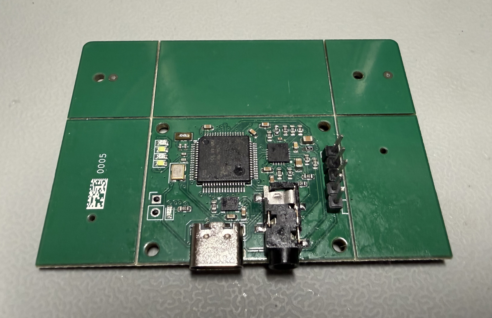

# HealthMonitor
> **Status: Work In Progress (Active Development)** 🚧

This repository contains the hardware and firmware for a custom, bare-metal biomedical wearable designed to capture and analyze Electrocardiogram (ECG) and Seismocardiogram (SCG) data.

## 📖 Project Overview
I designed a PCB with a low-power STM32U5 microcontroller, a low-noise density biosensor from ST (currently utilizing just its IMU), and an AD8232 analog front-end for ECG. 

The microcontroller receives an external interrupt from the IMU when a new measurement is ready, triggering a Direct Memory Access (DMA) read for both the IMU and the Analog to Digital Converter (ADC). This ensures the ECG is captured (almost) in sync with the corresponding physical acceleration. 

R-peak detection is performed in real time using the Pan-Tompkins++ algorithm [1]. Each R-peak yields a BPM estimate (averaged over the last 8 RR intervals) and RMSSD for Heart Rate Variability. This data is streamed to a host machine over a USB Virtual COM Port.

## 🗄️ Repository Structure
* `/hardware/Rev1`: Initial board design. **Note:** See `ERRATA.md` for a known schematic flaw regarding the AD8232.
* `/hardware/Rev2`: Fixed AD8232 flaw, added USB-C port, moved some components to the bottom layer.
* `/fw`: STM32 bare-metal C code, DSP pipelines, and TinyUSB implementation.

## 🚀 Current Focus & Next Steps
- [x] Hardware validation.
- [x] Synchronized IMU and ECG data capture with DMA.
- [x] BPM and RMSSD (HRV) calculation with Pan-Tompkins++.
- [x] Bare metal USB CDC communication via TinyUSB.
- [ ] **Current:** IMU DSP pipeline for real-time respiratory rate extraction.
- [ ] Heartbeat detection via Seismocardiography (SCG).
- [ ] Offloading Human Activity Recognition (HAR) to the IMU's Machine Learning Core.
- [ ] Firmware refactoring and documentation cleanup.

## ⚖️ Acknowledgments
* USB stack powered by the excellent open-source [TinyUSB](https://github.com/hathach/tinyusb) library (MIT License).

## References
[1] M. N. Imtiaz and N. Khan, "Pan-Tompkins++: A Robust Approach to Detect R-peaks in ECG Signals," in *Proc. IEEE Int. Conf. Bioinformatics and Biomedicine (BIBM) Workshops*, 2022. [Online]. Available: https://arxiv.org/abs/2211.03171
